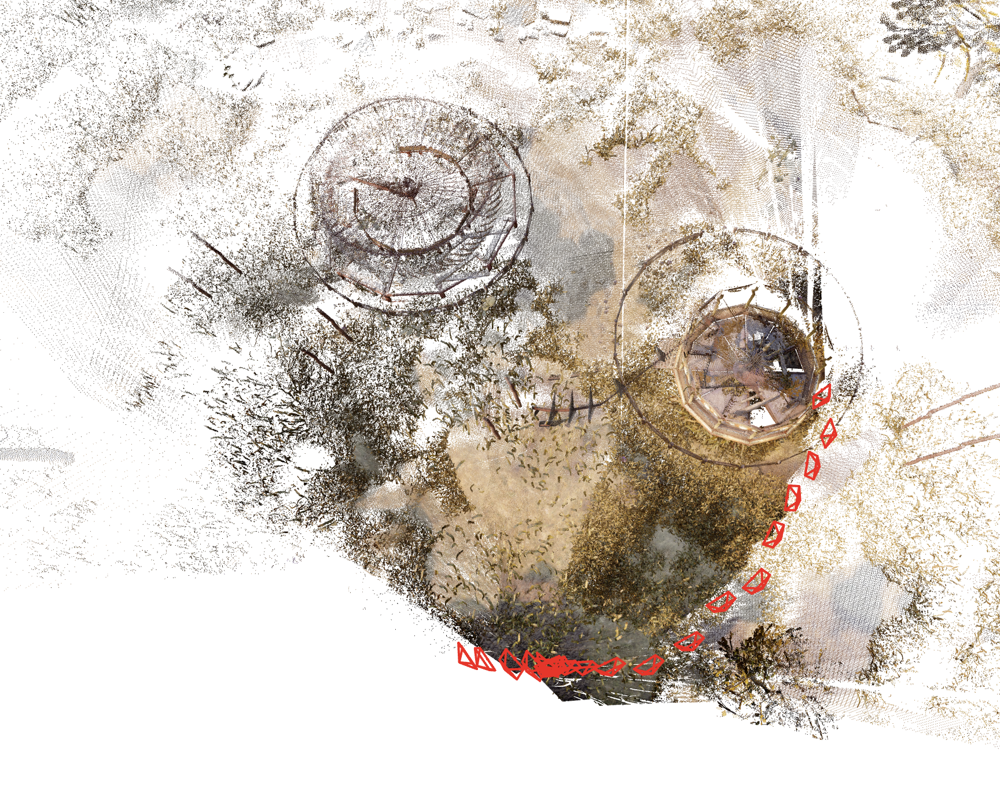

Downloaded some sample trajectories from https://theairlab.org/tartanair-dataset/ for testing this.

These are synthetic scenes that allow me to synthetically create equivariant features from the pointmaps themselves, but in principle 
we could get our equivariant features from some deep learnt source.

`python toy-test.py` will run the script, but you can use the batchscript to copy all the files into a subdir and run from there
by running `./jobscript.sh <TESTNAME> "python toy-test.py"` where `<TESTNAME>` is a name for the test run that the folder will be
named after.

Sample Reconstruction on Tartanair Amusement Park P008 with very simple synthetic equivariant features (random linear projection of g.t. pointmap for this case)

You can see that we regress not just the correct camera locations but the scene coordinates, and we get a full metric reconstruction with correct focal lengths, not just an affine reconstruction (see HZ for minimum number of images needed for autocalibration under different camera models and the min number of views to get a correct metric reconstruction as opposed to an affine reconstruction).